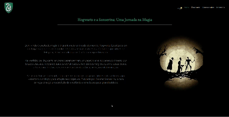

<h1>Hogwarts - Slytherin</h1>  

  
This is an website made for Slytherin students (that's also my house) and sort of a guide to the new ones.

  
I made this one for a HTML and CSS college project.

  
  
You can check the page, and see it working <a href="https://yasminconstantino.github.io/Hogwarts-Slytherin/">here</a>

  <h4> Languages and Technologies:</h4>
  

    
    
  

 
<h5>...</h5>
 
<section>
  

    
Clique aqui para ler em português

     
    
Esse é um site feito para alunos da Sonserina (que também a minha comunal) e uma especia de guia para os novos estudantes.

     
    
Eu fiz esse site para um trabalho de HTML e CSS da faculdade

    
Você pode acessar a página e ver ela funcionando <a href="https://yasminconstantino.github.io/Hogwarts-Slytherin/">aqui</a>

    <h4>Linguagens e tecnologias utilizadas:</h4>
    

        
        
    

  

</section>
